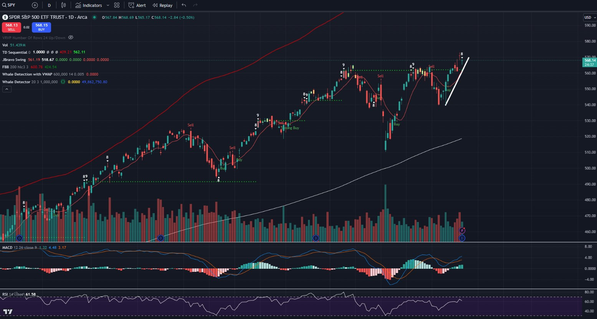
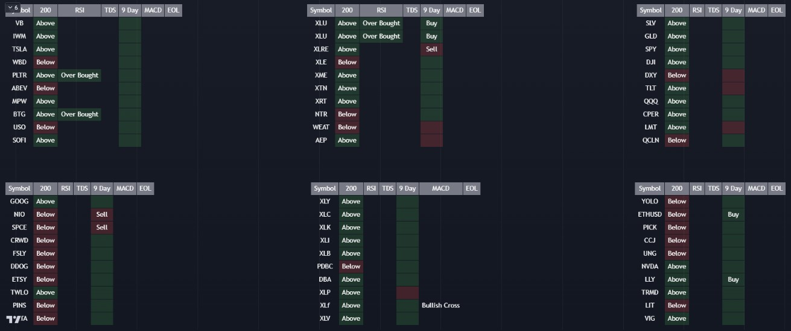

# stonks
Pine scripts for tradingview; indicators and scanners.

Some of these I wrote with assistance from AI.  Some of them I ganked from other people.  I will try to attribute credit where I can.

Usage:  Just cut/paste the code into the tradingview code window and "save as".  I recommend using the name for the script name.  I.E. fibbands, whale_vol etc.  Then add indicator to chart.

# fibbands.pine

This is one I "borrowed" from bradvaughn.  It should add upper and lower bands to the chart using fibonacci.

This is the no-no zone.  If a equity moves into this zone, it could be time to take profit.

# tdsequential.pine

Another borrowed and modified script.  This time by johan.gradin.

This implementation will give an 8, 9, count for TD Sequential.  After that count it will show when a trend is over extended with a gold bar.  Remember, that this indicator is not perfect and that it has to be interpreted.  At times, it can show up indicating there is strength in the current trend and not that it is ending.

# whale_vol.pine

This will add a gold "+" to the chart when volume is larger than average.

# whale_vwap

This will add a red "+" to the chart when volume is large in context of the VWAP

# scanner.pine

This is my current scanner.  Once you save it you can modify it to give you up to 10 stocks.  Then you can use this to create additional tables by modifying the location and stocks in a different script.  This will yeild a result that looks like this:

